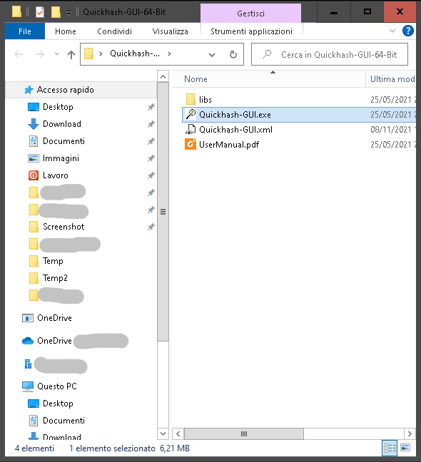

# SHAREPOINT-BACKUP

SharePointBackup is a Powerful PowerShell script that allow you to locally backup all sites of your organizations that you own in Microsoft SharePoint Online.

The script backups the sites in a local Zip file and with Powerfull integrated log system,
allows you to receive the status of backup progress (info,errors) via:

- .txt file log

- mail notification  (with SendGrid provider)

- Teams notification (with WebHook connectors)

- Excel report

and with Wasabi it can store your site into a cold storage for (an example) Disaster Recovery..

## Getting Started

- Create a **Config** folder into script's folder.
- Copy appsettings.json and sites.txt from [**Config**](https://github.com/NicoGenti/SharePointBackup/tree/website/Config) folder into your **Config**
- For notification mail this app use SendGrid provider.
- For notification Teams this app use Microsoft WebHook connectors.
- For upload file from local storage to Wasabi, you need a [Wasabi](https://wasabi.com/) User.
- You need to have 7z (or some app similar), installed on your Windows PC. Download 7z from [here](https://www.7-zip.org/download.html).
- Looks for your Linux distribution (Debian, Ubuntu, Fedora,ecc), installation can be different but with same result.

***P.S.***
This features can be disable from appsettings file (change yes to no):
 - Send mail notifications;
 - Send Teams notifications;
 - Upload to Wasabi.

## Installation

How to have a nice installation of ***SHAREPOINT-BACKUP***

1. Setup for Email Sender

- 1.1 Login here [SendGrid Login](https://app.sendgrid.com/login) and insert your username + password:

- 1.2 or Create an account from [SendGrid SignUp](https://signup.sendgrid.com/)

- 1.3 Login and Create a Single Sender:

- 1.4 Set the request parameters:

- 1.5 Click the link and verificate your Sender:

- 1.6 Return on your browser. Now you have the sender verificated! Then click drop-down-menu **Email API** and go to **Integration Guide**:

- 1.7 Click on **Choose Web API**:

- 1.8 Click on C# **Choose**:

- 1.9 Choose your **Key Name** (whatever you like) and click **Create Key**:

- 1.10 Now copy the key on file appsettings.json in Config folder into parameter: **Token**:

**PAY ATTENTION** Copy this key now, beacause it's impossible to recover later:

- 1.11 Click on checkbox and press **Next: Verify Integration**:

- ✅ Now you have set the Sender Profile! ✅

2. Setup for Teams Sender

- 2.1 Go to the channel where you want this to write the message
- 2.2 Click on the settings of the channel
- 2.3 Select the Connectors

- 2.4 Search or find the Incoming Webhook
- 2.5 Create a name for this webhook, if you want to have an image to identify upload it and then click on Create.

- 2.6 Copy the URL created it will be needed for the PowerShell of this example of Create a new site.

- 2.7 Click on Done.
- 2.8 The webhook is now ready to receive our messages sent via PowerShell. Now copy the code below on **"URI"** replace with the URL saved when created the webhook.

3. Download script Windows/Linux

- 3.1 Go to [link](https://github.com/NicoGenti/SharePointBackup/blob/website/sharepointbackup.ps1) and download the portable version for your OS

- 3.2 HASH VERIFICATION:
	- 2.2.1 Go into QuickhashGUI folder and download (on your Desktop) and run **QuickhashGUI** version for your OS;
	- If app version, into Release folder is to old, you can dowloaded it from [here](https://www.quickhash-gui.org/downloads/);

	
- 3.2.2 
    - Now click on Tab *File* (1),
    - choose *SHA256* (**2**),
    - select file *sharepointbackup.ps1* (**3**),
    - copy and past hash from *HashSharePointBackupVX.X.txt* into textbox (**4**),
    - If popup box say's *MATCHES*, you have download it correctly (**5**).

	

- 3.3 Extract the Zip folder anywhere you want on your PC

- 3.4 First step configure the **appsettings.json**:

---

### **PAY ATTENTION**

It's recommended modify only this parameters:

---

- 3.4 Configure **sites.txt** with your SharePoint's sites (*sites new line new sites!!*)

- 3. 5 Into PowerShell with Administrator role run this command:	
	- 3.5.1: Install-Module PnP.PowerShell -Force
	  - 3.5.1.1: Register-PnPManagementShellAccess (user and password are the same of SharePoint admin)
	- 3.5.2: Install-Module -Name PSSendGrid -Force
	- 3.5.3: Install-Module PoShLog -Force
	- 3.5.4: Install-Module -Name PoShLog.Enrichers -Force
	- 3.5.5: Install-Module -Name ImportExcel
	- 3.5.6: Install-Module -Name AWSPowerShell -Force
	*(They are all Modules that sharepointbackup.ps1 use)*
	
- 3.6 Then run the sharepointbackup.ps1

***IMPORTANT ONLY FOR LINUX USERS**

- 3.7 Before run ./sharepointbackup set envoirment PowerShell into Linux OS:    
    - 3.7.1: new Terminal
    - 3.7.2: $: sudo apt-get update
    - 3.7.3: $: sudo apt-get install -y wget apt-transport-https software-properties-common
    - 3.7.4: $: wget -q **link of your package distribution** [file Deb here](https://docs.microsoft.com/it-it/powershell/scripting/install/installing-powershell-on-linux?view=powershell-7.2#ubuntu-1804)
    - 3.7.5: $: sudo dpkg -i packages-microsoft-prod.deb
    - 3.7.6: $: sudo apt-get update
    - 3.7.7: $: sudo add-apt-repository universe
    - 3.7.8: $: sudo apt-get install -y powershell
    - 3.7.9: $: pwsh
    - 3.7.10 install all Modules (Point 3.5)
    
- 3. 8✅ Congratulations you stored your sites localy!! ✅

---
## Output

4. Example Output

- 4.1 Logs Folder:
	- 4.1.1 ErrorList.txt
	- 4.1.2 logDateTime.txt
	- 4.1.3 SiteReport.xlsx

- 4.3 Mail:

- 4.4 Teams:

---

## Contributing

For your question send un email to: nicolas.gentilucci@live.it

## License

sharepointbackup is Copyright © 2021-2021. It is free
software, and may be redistributed under the terms specified in the
[LICENSE](./LICENSE) file.